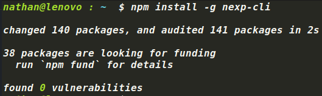
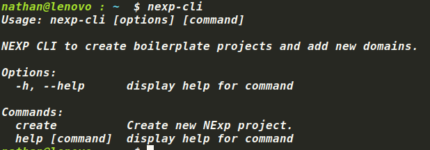
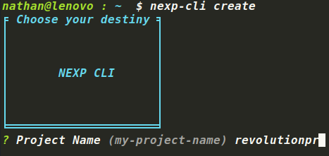
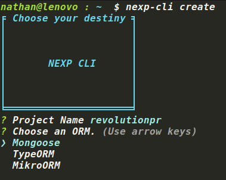
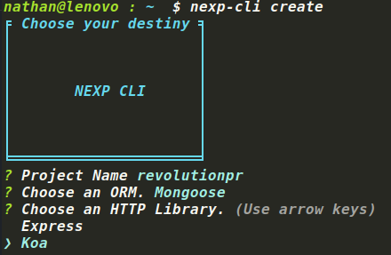
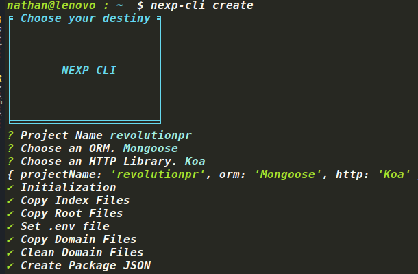
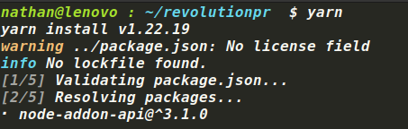
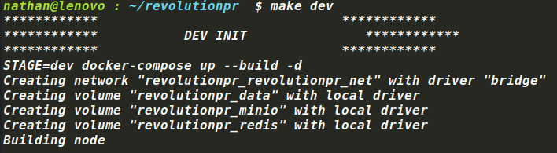
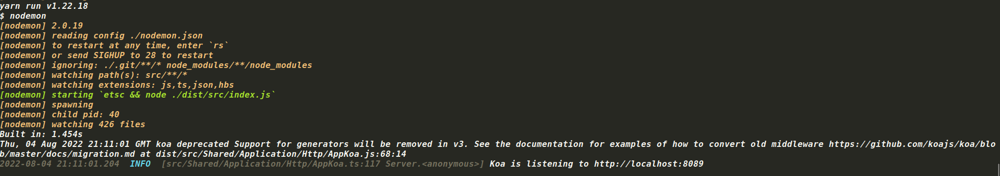

# Quick Start

## NEXP CLI

[Nexp CLI](https://github.com/DigiChanges/nexp-cli)

> This CLI is made to be able to quickly create the NExp(https://github.com/DigiChanges/node-experience) boilerplate with all the content you want it to have.
> 
> It allows you to choose between Mongoose, TypeORM and MikroORM when it comes to database persistence. In addition, you can also choose between Koa and Express for the HTTP library.
> 
> This tool allows you to use NExp without the need to modify the code.

## Installation

First, install nexp-cli using [npm](https://www.npmjs.com/) (we assume you have pre-installed [node.js](https://nodejs.org/)).

## Step by Step
#### First of all install nexp cli package globally.

 

#### Currently, there is a `create` command call, in the future more commands will be added.



#### Write the name of the project.



#### Choose the ORM.



#### Choose the HTTP library.



#### And wait for each action to complete.



#### Copy .env.dev to .env and install dependencies with yarn or npm.



#### Execute `make dev` command or `STAGE=dev docker-compose up --build -d` to create docker containers.

* Node
* DB
* Redis
* Mail
* Minio



#### And it's ready to code.



## Local Environment

We can run the project directly with docker compose and then bash where the basic commands to feed the database are located.

1. Install dependencies. `pnpm install`.
2. Copy `.env.dev` file to `.env`.
3. Then execute `STAGE=dev docker-compose up --build` to up all containers.
4. Basically generates an admin user, add roles with permission and get a bucket for minIO. `docker-compose exec node bash dev.init.sh`


Then generate your new project:

```bash
yo generator-nexp-cli
```

## Bash dev.init.sh Content
```bash
#!/usr/bin/env bash

yarn command addUserRole --role Admin --email user@node.com --firstName node --lastName node --password 12345678 --documentType DNI --documentNumber 12345678 --gender male --phone 541112345678 --country AR --address av.1234 --isSuperAdmin false --birthday 04/07/1990
yarn command addUserRole --role SuperAdmin --email superadmin@node.com --firstName super --lastName admin --documentType DNI --documentNumber 12345679 --gender male --phone 541112345678 --country AR --address av.1234 --password 12345678 --birthday 05/07/1990 --isSuperAdmin true
yarn command syncRolesPermission
yarn command createBucket --name experience --region us-east-1
```

## Create Push Notifications Keys

```bash
yarn docker:command createVapID
```

## Minio Browser

[http://localhost:9001/minio](http://localhost:9001/minio)


## Execute TEST Environment

To run the tests, we need to install the packages and transpile the code, we also need the `.env` environment variable to exist.

```bash
yarn test
```

## Test different folder

```bash
yarn test src/[Module]/Tests
```

Example Unique Test

```bash
yarn test src/Item/Tests
```

## How to use TypeORM:

Node experience comes integrated with Mongoose as the default ORM. It also has TypeORM integrated to use any SQL engine 
that is required.

To change from Mongoose to TypeORM the following steps must be followed:
     
To take an example we are going to use Postgres.
     
1. Environment variables have to be changed.
   
   1. `DB_PORT=27017 -> DB_PORT=5432`
   2. `DB_TYPE_DEFAULT=Mongoose -> DB_TYPE_DEFAULT=TypeORM` 
   3. `DB_TYPE=postgresql -> DB_TYPE=postgres`
    

2. Important note. The filters and sorting files of each entity should also have a change depending on the relationship.
    For example UserSort has
       
```ts   
class UserSort extends Sort {
   static readonly EMAIL: string = 'email';
   static readonly CREATED_AT: string = 'createdAt';
}
```       

This should change to
              
```ts 
   class UserSort extends Sort {
   static readonly EMAIL: string = 'i.email';
   static readonly CREATED_AT: string = 'i.createdAt';
   }
```  

This is because typeORM and SQL aliases are used and in this case it is necessary for you to 
understand each filter and each order that we need to add.
     
3. Finally, we have a command with Makefile to lift the corresponding containers.
    1. `make dev_sql`
    2. The command with docker compose would be: 
    `STAGE=dev docker-compose -f docker-compose.yml -f docker-compose.sql.yml up --build -d`
           
This above command replaces the mongo container with the postgres container.

## How to use Mikro-ORM:

To change to Mikro-ORM the following steps must be followed:
     
To take an example we are going to use Postgres.
     
1. Environment variables have to be changed.
   1. `DB_PORT=27017 -> DB_PORT=5432`
   2. `DB_TYPE_DEFAULT=Mongoose -> DB_TYPE_DEFAULT=MikroORM`
   3. `DB_TYPE=postgresql`

2. Finally, we have a command with Makefile to lift the corresponding containers.
   1. `make dev_sql`
   2. The command with docker compose would be:
            
    `STAGE=dev docker-compose -f docker-compose.yml -f docker-compose.sql.yml up --build -d`

## TypeORM and MikroORM       

In the case of not using Mongoose you have to synchronize the database tables. With this command you can synchronize them regardless if you are using MikroORM or TypeORM.

```bash
docker-compose exec node bash
yarn sync-db
```
