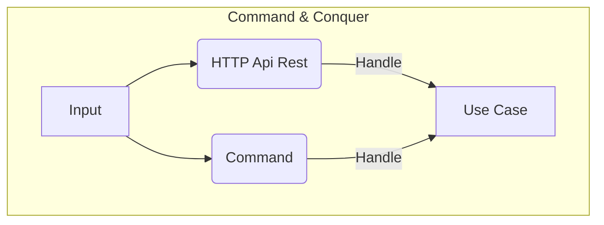

# Commands

Node Experience thanks to the commander package I have the ability to execute commands.

The commands in this case are to execute Domain Use Cases. They would be a replacement for an API Rest, conceptually speaking. Therefore, if in the Rest API of the User domain we have an endpoint to create a User, we can also execute a command to create a user or a role in the case of the Role domain.

This leaves us with the benefits of being able to reuse the code already created and only change the way the data is entered.

## AddUserRole
  * command: `pnpm command addUserRole`
  * docker command: `pnpm docker:command addUserRole`
  * options:
    * `-r, --role`
    * `-e, --email`
    * `-fn, --firstName`
    * `-ln, --lastName`
    * `-p, --password`
    * `-dt, --documentType`
    * `-dn, --documentNumber`
    * `-g, --gender`
    * `-ph, --phone`
    * `-c, --country`
    * `-a, --address`
    * `-bir, --birthday`
    * `-isa, --isSuperAdmin admin` 

## AddUser
  * command: `pnpm command addUser`
  * docker command: `pnpm docker:command addUser`
  * options:
    * `-e, --email`
    * `-fn, --firstName`
    * `-ln, --lastName`
    * `-p, --password`
    * `-dt, --documentType`
    * `-dn, --documentNumber`
    * `-g, --gender`
    * `-ph, --phone`
    * `-c, --country`
    * `-a, --address`
    * `-bir, --birthday`
    * `-isa, --isSuperAdmin` 

## AddRole
  * command: `pnpm command addRole`
  * docker command: `pnpm docker:command addRole`
  * options:
    * `-n, --name` 
    * `-s, --slug`

## AssignRoleToUser
  * command: `pnpm command assignRoleToUser`
  * docker command: `pnpm docker:command assignRoleToUser`
  * options:
    * `-n, --name`
    * `-s, --slug`

## CreateVapID
  * command: `pnpm command createVapID`
  * docker command: `pnpm docker:command createVapID`

## SyncRolesPermission
  * command: `pnpm command syncRolesPermission`
  * docker command: `pnpm docker:command syncRolesPermission`

## CreateBucket
  * command: `pnpm command createBucket`
  * docker command: `pnpm docker:command createBucket`
  * options:
    * `-b, --name`
    * `-r, --region`

## Seed
  * command: `pnpm command seed`
  * docker command: `pnpm docker:command seed`
    * arguments: `[name]`
    * options:
      * `-l, --list`  

## ActiveUser
  * command: `pnpm command activeUser`
  * docker command: `pnpm docker:command activeUser`
  * options:
    * `-e, --email`

# Common mistakes

When we want to use the commands we have to be aware that they would be replacing an API, therefore in the process of executing a command what the system does internally is to generate a new NodeJS process separate from the API Rest. Therefore we find a new connection to the database.

With this then we are at a common error that is to execute the command outside the container, where it will always be failing since the connection to the database is not local, but internal within the docker. Therefore we must use the docker command to execute the command internally in the container.
