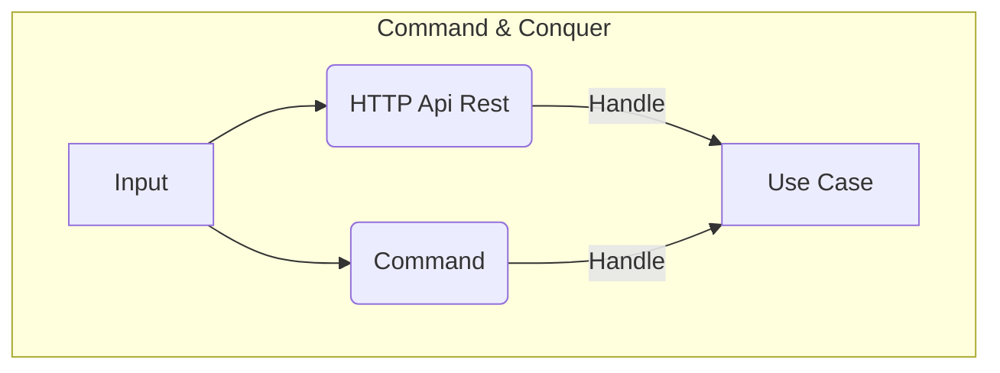

# Commands

Node Experience thanks to the commander package, I have the ability to execute commands.

The commands in this case are to execute Domain Use Cases. They would be a replacement for an API Rest, conceptually speaking. Therefore, if in the Rest API of the User domain we have an endpoint to create a User, we can also execute a command to create a user or a role in the case of the Role domain.

This leaves us with the benefits of being able to reuse the code already created and only change the way the data is entered.

## SyncRolesPermission
  * command: `pnpm command syncRolesPermission`
  * docker command: `pnpm docker:command syncRolesPermission`

## CreateBucket
  * command: `pnpm command createBucket`
  * docker command: `pnpm docker:command createBucket`
  * options:
    * `-b, --name`
    * `-r, --region`

## Seed
  * command: `pnpm command seed`
  * docker command: `pnpm docker:command seed`
    * arguments: `[name]`
    * options:
      * `-l, --list`
