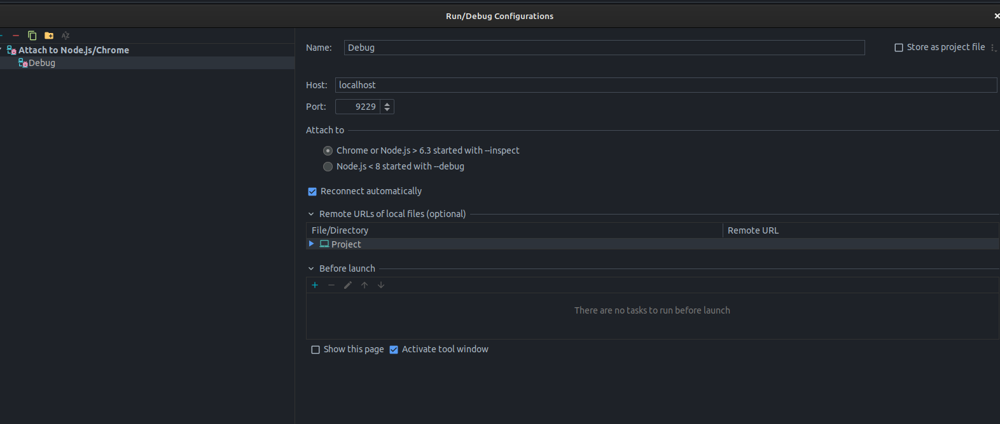
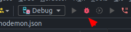
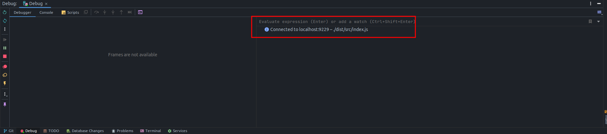
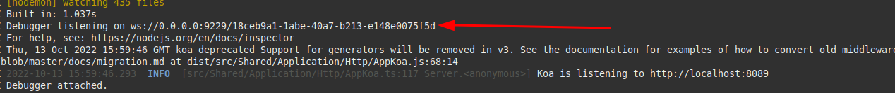

# Debugging

Node Experience is configured so that the debugger can be run in any code editor or IDE.

The configuration that makes it possible is the following:

1. The **docker-compose** exposes port `9229` which is the current Node.js default port for debugging an application.
2. The Dockerfile where the Node container image is built also exposes the same port `9229`.
3. Since the debugger is running in development mode, we have the **package.json** `pnpm dev` command that is run by nodemon. In the node configuration we have the complete execution, `etsc && node --inspect=0.0.0.0:9229 ./dist/src/index.js`. The `etsc` compiles the typescript, and then we execute the transpiled file like any normal node project with the difference that we add the `--inspect=0.0.0.0:9229` in this case we have to add the ip **0.0.0.0**, so you can have access through the docker network.

Therefore, it is possible to debugger with any editor.

## Example with IntelliJ Webstorm

1. First, we need to get the project running. We would need to have the containers running as if we were using the project normally.
2. We have to enter `Run -> Edit Configurations`
3. As attached in the image, we search for `Attach to NodeJS/Chrome` and add the host and port then accept the configuration.

4. We have to click on the `bug` button.

5. This message tells us that it is connected correctly. So now we can start generating the breakpoints in the editor.

### Note

We can find that it stays connecting all the time and does not end up making the connection correctly. In that case we need to understand that the service was actually executed correctly on the side of the docker container. Therefore, in addition to checking that the API tells us that it is listening, we also need to see the message that the debugger is listening on port `9229` correctly.

